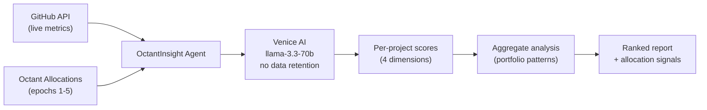

# OctantInsight — Autoresearch for Grants

> Octant allocated 2,377 ETH across 10 projects in 5 epochs. 45% went to just two projects. Nobody flagged it. This agent does — in 100 seconds.

OctantInsight applies the [Karpathy autoresearch pattern](https://github.com/karpathy) to public goods evaluation. It collects live GitHub metrics, scores each project across 4 weighted dimensions via private AI reasoning (Venice, no data retention), and outputs ranked evaluations with concrete allocation signals: increase, maintain, or flag for review.

**Core thesis:** Evaluation criteria are the editable asset. Just as Karpathy's autoresearch iteratively improves `program.md` against `val_bpb`, OctantInsight's planned AutoEval Loop improves `eval_criteria.md` against Impact Prediction Accuracy (IPA). Criteria that predict better survive. The rest get reverted.

---

## Pipeline



| Phase | What Happens | Time |
|-------|-------------|------|
| **Collect** | Fetch GitHub metrics (stars, commits/90d, contributors, weekly activity) for 10 projects | ~50s |
| **Analyze** | Venice AI scores each project: Impact (0.35), Sustainability (0.25), Community (0.20), Funding Alignment (0.20) | ~50s |
| **Aggregate** | Cross-project pattern detection: concentration risk, engagement decay, category efficiency | ~7s |
| **Rank** | Ranked leaderboard + allocation signals (increase / maintain / flag) | instant |

---

## What It Found

From a live run against 10 Octant-funded projects, 2,377.2 ETH tracked across epochs 1-5:

| Finding | So What |
|---------|---------|
| Core Infrastructure scores higher than Funding Mechanisms but gets less ETH | Systematic misallocation — the most impactful category is underfunded |
| Gitcoin + Protocol Guild = 45% of total funding | Single-point-of-failure risk at portfolio level |
| BrightID and clr.fund: declining allocations + declining commits (r=0.60) | Community is already detecting underperformance — they just lack a framework to act on it |
| Projects with >10 weekly commits at 90d post-funding sustain long-term | Commit frequency at 90 days is the leading indicator — codifiable as a heuristic |
| Contributor growth rate beats absolute star count as an impact signal | Vanity metrics mislead; trajectory matters |

---

## Run It

```bash
git clone https://github.com/mxber2022/octant-analyzer.git
cd octant-analyzer
npm install

# Required: Venice API key
echo "VENICE_API_KEY=your_key_here" > .env

# Optional: GitHub token (60 req/hr → 5,000 req/hr)
echo "GITHUB_TOKEN=your_token" >> .env

npx tsx src/index.ts
```

**Output:** `analysis_report.json` (ranked scores + insights) and `agent_log.json` (timestamped execution trace).

---

## Scoring Framework

| Dimension | Weight | Measures | Key Signal |
|-----------|--------|----------|------------|
| **Impact** | 0.35 | Value per ETH | Commit velocity, contributor growth |
| **Sustainability** | 0.25 | Health trajectory | Trend direction, funding continuity |
| **Community** | 0.20 | Engagement depth | Stars-to-commits ratio, retention |
| **Funding Alignment** | 0.20 | Is funding calibrated? | Score vs. ETH ratio, category benchmarks |

### Allocation Signals

```
Score ≥ 7  +  growing   →  INCREASE
Score 5-6  +  stable    →  MAINTAIN
Score < 5  OR declining →  FLAG for review
```

---

## Track Submissions

| Track | Prize | Submission |
|-------|-------|-----------|
| **Mechanism Design** | $1,000 | 4-dimension scoring + AutoEval Loop design + IPA metric |
| **Data Analysis** | $1,000 | Portfolio patterns, engagement decay, category efficiency |
| **Data Collection** | $1,000 | GitHub API pipeline, allocation aggregation, derived signals |

Detailed submissions: [`docs/submission/`](docs/submission/)

---

## Source Files

| File | What It Does |
|------|-------------|
| `src/index.ts` | 4-phase pipeline orchestrator |
| `src/github.ts` | GitHub API client (rate-limited, error-tolerant) |
| `src/projects.ts` | 10 project definitions + epoch allocation data |
| `src/venice.ts` | Venice AI scoring (per-project + aggregate) |

Full architecture: [`docs/ARCHITECTURE.md`](docs/ARCHITECTURE.md)

---

## Why Venice AI

The agent reasons over sensitive signals: which projects underperform, which categories get gamed, which allocation patterns suggest coordination. Venice's **no-data-retention** inference ensures this reasoning stays private. Only structured scores and insights get output.

---

## MEL³ Vision (Designed, Not Yet Built)

OctantInsight is the hackathon MVP of **MEL³** (Monitoring, Evaluation & Learning × Mandate Execution Layer):

- **AutoEval Loop** — Evaluation criteria that improve themselves (Karpathy pattern for grants)
- **IPA** — Impact Prediction Accuracy (correlation + threshold accuracy + inverted MAE)
- **On-chain contracts** — EvaluationMandate, ReputationOracle, AutoEvalRegistry on Base
- **ERTs** — Evaluation Reputation Tokens: non-transferable, time-decaying agent reputation

Roadmap: [`docs/roadmap/v1-roadmap.md`](docs/roadmap/v1-roadmap.md)

---

## Docs

| Document | What's In It |
|----------|-------------|
| [`docs/ARCHITECTURE.md`](docs/ARCHITECTURE.md) | System architecture + data flows |
| [`docs/submission/octant-track1-mechanism-design.md`](docs/submission/octant-track1-mechanism-design.md) | Track 1: Mechanism Design |
| [`docs/submission/octant-track2-data-analysis.md`](docs/submission/octant-track2-data-analysis.md) | Track 2: Data Analysis |
| [`docs/submission/octant-track3-data-collection.md`](docs/submission/octant-track3-data-collection.md) | Track 3: Data Collection |
| [`docs/roadmap/v1-roadmap.md`](docs/roadmap/v1-roadmap.md) | Post-hackathon roadmap |
| [`docs/research/mel-framework-analysis.md`](docs/research/mel-framework-analysis.md) | Traditional MEL ↔ agent evaluation |
| [`docs/research/competitive-landscape.md`](docs/research/competitive-landscape.md) | Competitive landscape |
| [`docs/code-suggestions.md`](docs/code-suggestions.md) | Implementation suggestions |

---

## Team

| Handle | Role |
|--------|------|
| **[@mxber2022](https://github.com/mxber2022)** (Max) | Agent code, pipeline architecture, Venice integration |
| **0xJitsu** | Evaluation methodology, submission strategy, competitive analysis, documentation |

---

## Stack

TypeScript + Node.js (ESM) · Venice AI (llama-3.3-70b, no data retention) · GitHub Public API · tsx

---

## License

MIT
