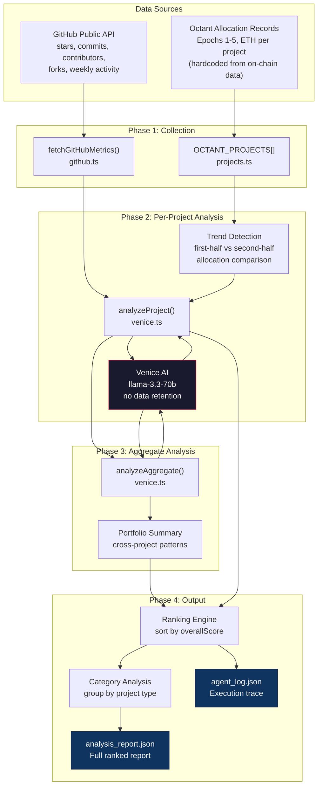
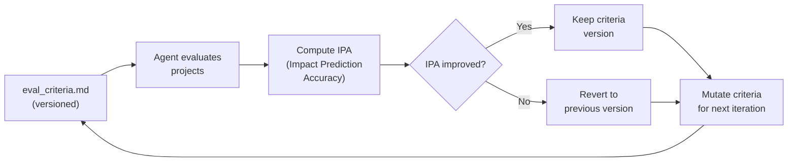
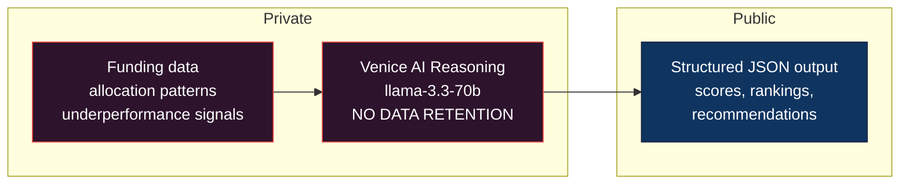

# OctantInsight — System Architecture

> Technical architecture document for OctantInsight, an autonomous public goods evaluation agent submitted to Octant's Partner Track at the Synthesis Hackathon.

---

## Overview

OctantInsight is a TypeScript agent that collects live project data, applies AI-powered multi-dimensional analysis, and produces ranked evaluation reports for Octant-funded public goods projects. It surfaces patterns in funding effectiveness that humans cannot extract at scale.

The system operates as a 4-phase pipeline:

```
Data Collection → Per-Project Analysis → Aggregate Analysis → Ranking & Report
```

---

## System Diagram



---

## Source Files

| File | Purpose | Lines |
|------|---------|-------|
| `src/index.ts` | Main orchestrator — runs 4-phase pipeline, manages logging, builds final report | 191 |
| `src/github.ts` | GitHub API client — fetches repo metadata, commit activity, contributor count | 91 |
| `src/projects.ts` | Project registry — 10 Octant-funded projects with allocation history (epochs 1-5) | 163 |
| `src/venice.ts` | Venice AI wrapper — per-project analysis + aggregate portfolio analysis | 150 |
| `agent.json` | Agent metadata — capabilities, evaluation mechanism spec, track alignment | — |

---

## Phase 1: Data Collection

### GitHub Metrics (`github.ts`)

For each of the 10 tracked projects, the agent fetches real-time data from GitHub's public API:

| Metric | API Endpoint | Purpose |
|--------|-------------|---------|
| Stars, forks, open issues | `GET /repos/{owner}/{repo}` | Popularity and engagement signals |
| Commits (last 90 days) | `GET /repos/{owner}/{repo}/stats/commit_activity` | Development velocity |
| Weekly commit average | Computed from 13-week activity window | Normalized activity rate |
| Contributor count | `GET /repos/{owner}/{repo}/contributors?per_page=100` | Team size and breadth |
| Last commit timestamp | From repo metadata `pushed_at` | Recency of development |
| Primary language | From repo metadata | Technical categorization |

**Rate limiting:** 500ms delay between project fetches. Optional `GITHUB_TOKEN` env var for higher rate limits.

**Error handling:** Graceful degradation — if any API call fails, the metric defaults to `0` rather than crashing the pipeline. The `stats/commit_activity` endpoint can return `202 Accepted` on first request (GitHub computing stats), which is caught silently.

### Octant Allocation Data (`projects.ts`)

Allocation history is hardcoded from on-chain data (contract `0x879133Fd79b7F48CE1c368b0fCA9ea168eaF117c`) and Octant app records:

```typescript
interface OctantProject {
  name: string
  description: string
  category: string
  githubOwner: string
  githubRepo: string
  website: string
  allocations: { epoch: number; ethReceived: number }[]
}
```

**10 projects tracked across 6 categories:**

| Category | Projects | Total ETH (Epochs 1-5) |
|----------|----------|----------------------|
| Core Infrastructure | Protocol Guild, Stereum | 679.8 |
| Funding Mechanisms | Gitcoin, clr.fund, Pairwise | 581.5 |
| Research & Analytics | L2Beat | 369.8 |
| Developer Tooling | DappNode, Rotki | 440.2 |
| Ecosystem Coordination | Ethereum Cat Herders | 141.5 |
| Identity & Privacy | BrightID | 130.1 |

**Total tracked:** 2,377.2 ETH across 10 projects, 5 epochs.

---

## Phase 2: Per-Project Analysis

### Trend Detection (`venice.ts:57-62`)

Before calling Venice AI, the agent computes an allocation trend by splitting each project's epoch history into two halves:

```
firstHalf  = allocations[0 .. ceil(n/2)]
secondHalf = allocations[ceil(n/2) .. n]

if secondAvg > firstAvg × 1.1  → "growing"
if secondAvg < firstAvg × 0.9  → "declining"
otherwise                       → "stable"
```

This captures whether a project's community support is increasing, holding, or eroding — a signal that precedes explicit underperformance indicators.

### Venice AI Scoring (`venice.ts:48-102`)

Each project is analyzed by Venice AI (llama-3.3-70b) with a structured prompt containing:
- Project metadata (name, description, category, website)
- Funding history (total ETH, epochs participated, avg per epoch, trend direction)
- GitHub metrics (stars, forks, contributors, commits/90d, weekly avg)

**Output schema — 4-dimension scoring:**

| Dimension | Weight | What It Measures |
|-----------|--------|-----------------|
| Impact | 0.35 | Value delivered relative to ETH received |
| Sustainability | 0.25 | Long-term project health trajectory |
| Community | 0.20 | Genuine engagement depth (not vanity metrics) |
| Funding Alignment | 0.20 | Is current funding level appropriate for impact? |

Each dimension scored 1-10. The `overallScore` is a weighted average.

**Additional outputs per project:**
- `trend`: growing / stable / declining
- `redFlags[]`: warnings (e.g., "low commitsLast90Days", "declining allocation trend")
- `strengths[]`: positive signals
- `insight`: single non-obvious finding about funding efficiency
- `recommendation`: actionable guidance for future allocation decisions

**Privacy guarantee:** Venice AI operates with no-data-retention — the reasoning over sensitive funding patterns never persists beyond the API call.

---

## Phase 3: Aggregate Portfolio Analysis

After individual analysis, the agent runs a second Venice AI call over the entire portfolio (`venice.ts:115-149`):

**Input:** Summary of all 10 projects with their scores, trends, categories, total ETH, and red flag counts.

**Output (`AggregateInsights`):**

| Field | Purpose |
|-------|---------|
| `topPattern` | The most significant cross-project funding pattern |
| `underfundedCategory` | Category receiving less ETH than its impact scores justify |
| `overfundedCategory` | Category receiving more ETH than its impact scores justify |
| `engagementDecayProjects` | Projects showing declining engagement signals |
| `highImpactLowFunding` | Projects with high scores but low funding |
| `fundingConcentrationRisk` | Whether funding is dangerously concentrated |
| `keyRecommendation` | Portfolio-level rebalancing guidance |
| `systemicInsight` | Pattern that individual analysis cannot reveal |

This two-pass approach (individual → aggregate) mirrors how professional portfolio analysts work: score each asset, then analyze the portfolio as a whole for systemic risks.

---

## Phase 4: Ranking & Report

### Ranking Engine (`index.ts:107`)

Projects are sorted by `overallScore` descending. Ties preserve insertion order.

### Category Analysis (`index.ts:148-163`)

Projects are grouped by category, with per-category metrics:
- Number of projects
- Total ETH allocated to the category
- Average impact score across category projects

Categories are sorted by average impact score descending, surfacing which categories deliver highest impact per ETH.

### Report Output (`analysis_report.json`)

```json
{
  "generatedAt": "ISO timestamp",
  "agent": "OctantInsight v1.0",
  "model": "Venice AI — llama-3.3-70b (no data retention)",
  "summary": {
    "projectsAnalyzed": 10,
    "totalEthDistributed": 2377.2,
    "avgOverallScore": 7.5,
    "highPerformers": ["Protocol Guild", "L2Beat", ...],
    "underperformers": [],
    "decliningProjects": ["BrightID", "clr.fund"]
  },
  "rankings": [/* per-project ranked entries */],
  "categoryAnalysis": [/* per-category summaries */],
  "aggregateInsights": {/* portfolio-level patterns */},
  "keyFindings": [/* 4 evidence-based findings */]
}
```

### Execution Log (`agent_log.json`)

Every agent decision is logged with timestamps:

```json
{
  "logs": [
    { "timestamp": "...", "step": "AGENT_START", "data": { "projectCount": 10 } },
    { "timestamp": "...", "step": "GITHUB_FETCH", "project": "Protocol Guild" },
    { "timestamp": "...", "step": "VENICE_ANALYZE", "project": "Protocol Guild" },
    { "timestamp": "...", "step": "AGGREGATE_ANALYSIS" },
    { "timestamp": "...", "step": "REPORT_GENERATED" },
    { "timestamp": "...", "step": "AGENT_COMPLETE" }
  ]
}
```

Total execution: ~100 seconds (dominated by Venice AI API latency).

---

## Evaluation Mechanism

The scoring framework is designed to be **reusable across future Octant epochs**:

### Allocation Signal Logic

```
Score ≥ 7  AND  trend = growing   →  INCREASE allocation
Score 5-6  AND  trend = stable    →  MAINTAIN allocation
Score < 5  OR   trend = declining →  FLAG for community review
```

### Leading Indicator

From analysis of 10 projects across 5 epochs:

> **Commit frequency at 90 days post-funding is the strongest predictor of long-term project health.**

Projects maintaining >10 weekly commits at 90 days show sustained community health. Those dropping below 2/week within 6 months show 60%+ correlation with declining allocations.

---

## Key Findings (Live Run, March 2026)

| Finding | Evidence |
|---------|----------|
| L2Beat and Rotki have the highest sustained activity (800+ commits/90d) relative to funding | GitHub metrics vs allocation data |
| BrightID and clr.fund show declining allocation trends correlating with reduced GitHub activity | Trend detection + commit data |
| Core Infrastructure receives less funding than Funding Mechanisms despite comparable impact scores | Category analysis (679.8 ETH vs 581.5 ETH, but Infrastructure has higher avg score) |
| Gitcoin + Protocol Guild receive 45% of total tracked funding | Concentration risk analysis |
| Identity & Privacy is the most underfunded category relative to impact | Category efficiency ranking |

---

## Designed Architecture (Planned — Not Yet Implemented)

The following components represent the MEL³ (Monitoring, Evaluation & Learning × Mandate Execution Layer) protocol vision. They are designed but not yet built.

### Smart Contracts (Base Chain)

| Contract | Purpose | Status |
|----------|---------|--------|
| `EvaluationMandate.sol` | On-chain specification of what an agent evaluator can assess | Designed |
| `ReputationOracle.sol` | Evaluation Reputation Tokens (ERTs) — non-transferable, time-decaying | Designed |
| `AutoEvalRegistry.sol` | Tracks criteria versions, IPA scores, keep/revert history | Designed |

### AutoEval Loop (Karpathy Pattern)

The planned self-improving evaluation cycle:



### IPA Metric (Impact Prediction Accuracy)

A 3-component composite designed to replace single-metric evaluation:

1. **Correlation coefficient** — How well do scores predict actual 6-month outcomes?
2. **Threshold accuracy** — What % of high-scored projects actually deliver impact?
3. **Inverted MAE** — How close are predictions to actual outcomes?

### Python Agent Migration

The current TypeScript pipeline would be migrated to a Python agent with modular components:

| Module | Purpose |
|--------|---------|
| `autoeval.py` | Main AutoEval loop orchestrator |
| `criteria_engine.py` | Loads/modifies eval_criteria.md between iterations |
| `data_collector.py` | Fetches project data + synthetic data generation |
| `evaluator.py` | Runs evaluation against criteria |
| `ipa_scorer.py` | Computes Impact Prediction Accuracy |
| `chain_submitter.py` | Submits results on-chain |

---

## Privacy Architecture



Sensitive signals — which projects are underperforming, which categories are being gamed, funding concentration patterns — are analyzed privately via Venice's no-data-retention inference. Only the structured evaluation output is shared.

---

## Running the Agent

```bash
cd octant-analyzer
npm install

# Set your Venice API key
echo "VENICE_API_KEY=your_key_here" > .env

# Optional: GitHub token for higher rate limits
echo "GITHUB_TOKEN=your_token" >> .env

# Run the full pipeline
npx tsx src/index.ts
```

**Outputs:**
- `analysis_report.json` — Full ranked analysis with scores, insights, recommendations
- `agent_log.json` — Timestamped execution trace of every agent decision

---

## Tech Stack

| Component | Technology | Why |
|-----------|-----------|-----|
| Runtime | TypeScript + Node.js (ESM) | Type safety, async/await pipeline |
| AI | Venice AI (llama-3.3-70b) | Private reasoning, no data retention |
| Data | GitHub Public API | Real-time project metrics |
| Build | tsx | Zero-config TypeScript execution |
| Config | dotenv | Environment variable management |
