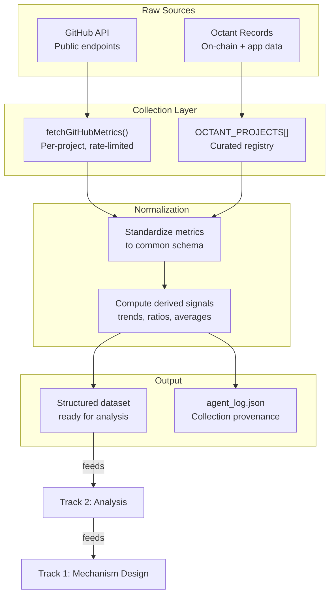

# Octant Track 3: Agents for Data Collection for Project Evaluation

> The agent collects 10 metrics per project from GitHub, computes 4 derived signals, and builds a structured dataset in ~50 seconds. A human reviewer doing the same work needs hours and a spreadsheet.

**Track:** Agents for Public Goods Data Collection ($1,000)
**Project:** OctantInsight (MEL³ Protocol)
**Team:** Maharaja (Max) + 0xJitsu

---

## The Problem With Current Data Collection

Octant allocators currently evaluate projects using:
- Self-reported proposals (the project tells you it's great)
- Manual GitHub spot-checks (one repo at a time, no cross-project view)
- Personal familiarity (who do you know on the team?)
- Informal community sentiment (vibes-based analysis)

This produces four failures: it doesn't scale past 30 projects, it's not reproducible between epochs, it creates no reusable dataset, and it has zero provenance — you can't audit how a funding decision was made.

OctantInsight replaces this with a **structured, reproducible collection pipeline** that feeds directly into analysis (Track 2) and mechanism design (Track 1).

---

## Data Collection Architecture (Built)

### Quantitative Signals: GitHub API

The agent collects 10 real-time metrics per project from GitHub's public API:

| Signal | API Source | What It Reveals |
|--------|-----------|-----------------|
| Stars | `GET /repos/{o}/{r}` | Community interest / visibility |
| Forks | `GET /repos/{o}/{r}` | Developer engagement / adoption |
| Open Issues | `GET /repos/{o}/{r}` | Active development vs. abandonment |
| Contributors | `GET /repos/{o}/{r}/contributors` | Team breadth and bus factor |
| Commits (90d) | `GET /repos/{o}/{r}/stats/commit_activity` | Development velocity |
| Weekly commit avg | Computed from 13-week window | Normalized activity rate |
| Last commit | `pushed_at` field | Recency of development |
| Primary language | `language` field | Technical categorization |
| Creation date | `created_at` field | Project maturity |
| Fetch timestamp | Agent-generated | Data provenance |

**Collection mechanics:**
- Rate limiting: 500ms delay between fetches, respects GitHub API limits
- Auth: Optional `GITHUB_TOKEN` for higher rate limits (5,000 req/hr vs 60/hr)
- Error handling: graceful degradation — failed fetches return `0` values with error logged, pipeline continues
- The `stats/commit_activity` endpoint can return `202 Accepted` (GitHub computing stats) — the agent catches this silently

### Quantitative Signals: Allocation History

Octant allocation data across epochs 1-5 is structured per-project:

```typescript
allocations: { epoch: number; ethReceived: number }[]
```

Per project, the agent collects:
- ETH received per epoch
- Total ETH across all epochs
- Average ETH per epoch
- Number of epochs participated
- Allocation trend (growing / stable / declining)

**Current limitation:** Allocation data is hardcoded in `projects.ts` from on-chain records (contract `0x879133Fd79b7F48CE1c368b0fCA9ea168eaF117c`). The planned MEL³ data collector would fetch this directly from the chain.

### Derived Signals

Beyond raw data, the agent computes derived signals that don't exist in any single source:

| Derived Signal | Computation | Why It Matters |
|---------------|-------------|----------------|
| Allocation trend | First-half vs second-half epoch average, ±10% threshold | Detects community sentiment shifts |
| Commits per ETH | `commitsLast90Days / totalEthReceived` | Funding efficiency proxy |
| Category efficiency | Avg score per category / total ETH to category | Identifies systemic misallocation |
| Engagement ratio | Stars-to-commits relationship | Distinguishes popular-but-inactive from active-but-unknown |

---

## Data Pipeline Flow



---

## Active vs. Passive Collection

| Type | Description | OctantInsight Implementation |
|------|-------------|------------------------------|
| **Active** | Agent fetches data on demand from APIs | GitHub metrics — real-time, per-run |
| **Passive** | Agent ingests pre-existing historical data | Allocation history — hardcoded from on-chain records |
| **Derived** | Agent computes new signals from raw data | Trends, ratios, category aggregations |

The current system combines active (GitHub) and passive (allocation history) collection. The planned MEL³ system would expand both:

### Planned Active Collection
- On-chain usage metrics (contract interactions, transaction volume)
- Dependency tracking (how many other projects depend on this one)
- Governance participation (voting activity, proposal authorship)

### Planned Passive Collection
- Forum discussion sentiment (Octant governance forum)
- Social media mentions and sentiment trajectory
- Grant milestone completion rates from other platforms (Gitcoin, ESP)

---

## Qualitative Signals

The current agent captures qualitative context through two mechanisms:

### 1. Project Descriptions
Each project includes a human-written description that provides qualitative context:

```typescript
{
  name: 'Protocol Guild',
  description: 'Funding mechanism for Ethereum core protocol contributors',
  category: 'Core Infrastructure'
}
```

This description is passed to Venice AI alongside quantitative metrics, enabling the AI to reason about the *type* of value a project delivers rather than just its activity level.

### 2. Venice AI Interpretation
Venice AI transforms quantitative metrics into qualitative insights:

**Input:** `commitsLast90Days: 47, contributors: 12, category: "Core Infrastructure"`

**Output:** "Protocol Guild's relatively low commit count is misleading — as a funding distribution mechanism rather than a development project, its impact should be measured by the downstream commit activity of funded contributors."

This is qualitative signal generation from quantitative data — the agent recognizes that the same metric (commit count) means different things for different project types.

---

## Legitimacy Detection (Designed, Not Yet Built)

The planned MEL³ data collection layer would include legitimacy checks:

### Sockpuppet Detection
- Contributor overlap analysis across projects
- Commit timing pattern analysis (bursty artificial commits vs. organic patterns)
- GitHub account age and activity diversity checks

### Grant Farming Signals
- Projects that appear in multiple funding platforms with minimal development between applications
- Proposal text similarity across platforms (copy-paste grant farming)
- Milestone completion rate vs. new grant applications ratio

### Milestone Gaming
- Commits that coincide with milestone deadlines but don't meaningfully advance the codebase
- Large commits that are primarily documentation or configuration changes counted as "development"
- Discrepancy between claimed deliverables and actual repository changes

---

## How Collection Feeds the Analysis Stack

The data collection layer is not standalone — it's designed to feed upstream:

```
Collection (Track 3) → Analysis (Track 2) → Mechanism Design (Track 1)
    ↓                      ↓                       ↓
 Raw metrics         Scored projects         Allocation signals
 + trends            + patterns              + recommendations
 + provenance        + insights              + evaluation framework
```

Each layer adds interpretive value:
- **Collection** normalizes disparate data into a common schema
- **Analysis** applies dimensional scoring and cross-project pattern detection
- **Mechanism Design** converts analysis into actionable allocation recommendations

Without systematic collection, analysis operates on anecdotes. Without analysis, mechanism design operates on gut feelings.

---

## Data Provenance

Every data point in the pipeline has provenance:

### Collection Provenance
- `fetchedAt` timestamp on every GitHub metrics fetch
- `GITHUB_FETCH` log entry with project name and timestamp
- Error logging when any fetch fails (`GITHUB_ERROR`)

### Analysis Provenance
- `VENICE_ANALYZE` log entry per project
- `AGGREGATE_ANALYSIS` log entry for portfolio analysis
- Full agent execution trace in `agent_log.json`

### Report Provenance
- `generatedAt` timestamp on the final report
- `agent` and `model` fields identifying which agent version and AI model produced the analysis

The planned MEL³ system would extend this with **on-chain provenance** — every data collection event would be recorded to a mandate contract, creating an immutable audit trail of what data the agent accessed, when, and what it concluded.

---

## Limitations

1. **GitHub as primary source.** Not all public goods projects have active GitHub repositories. Some deliver value through governance participation, community building, or infrastructure maintenance that doesn't manifest as commits.

2. **No on-chain data fetching.** Allocation history is hardcoded rather than fetched live from Octant's contract. This limits the system to pre-curated projects and requires manual updates for new epochs.

3. **API rate limits.** Without a GitHub token, the agent is limited to 60 requests/hour. With 3 API calls per project (repo metadata, commit activity, contributors), this caps data collection at ~20 projects/hour unauthenticated.

4. **Snapshot, not stream.** The agent collects data once per run. It doesn't maintain a historical database of metrics over time, which limits longitudinal analysis.

5. **No forum/social data.** Governance forum discussions, Discord activity, and Twitter/social sentiment are not collected. These are rich qualitative sources that the planned MEL³ system would capture.

6. **Contributor count approximation.** GitHub's contributor API is paginated. The agent fetches up to 100 contributors per page, which may undercount for very large projects.

---

## Track Alignment

| Track Requirement | OctantInsight Implementation |
|-------------------|------------------------------|
| Automated data collection | GitHub API fetching with rate limiting and error handling |
| Multiple signal types | Quantitative (GitHub metrics) + qualitative (descriptions, Venice interpretation) + derived (trends, ratios) |
| Structured output | Normalized schema: `GitHubMetrics` interface, `OctantProject` interface |
| Provenance tracking | Timestamps, log entries, error traces |
| Feeds downstream evaluation | Collection → Analysis → Mechanism Design pipeline |
| Scalable approach | Rate-limited, error-tolerant, extensible to new data sources |

---

## References

- GitHub API documentation: `api.github.com` endpoints used in `src/github.ts`
- Octant contract: `0x879133Fd79b7F48CE1c368b0fCA9ea168eaF117c`
- Collection implementation: `src/github.ts` (91 lines), `src/projects.ts` (163 lines)
- Execution trace: `agent_log.json`
- [docs/ARCHITECTURE.md](../ARCHITECTURE.md) — Full system architecture
- [docs/submission/octant-track1-mechanism-design.md](octant-track1-mechanism-design.md) — Mechanism design submission
- [docs/submission/octant-track2-data-analysis.md](octant-track2-data-analysis.md) — Data analysis submission
